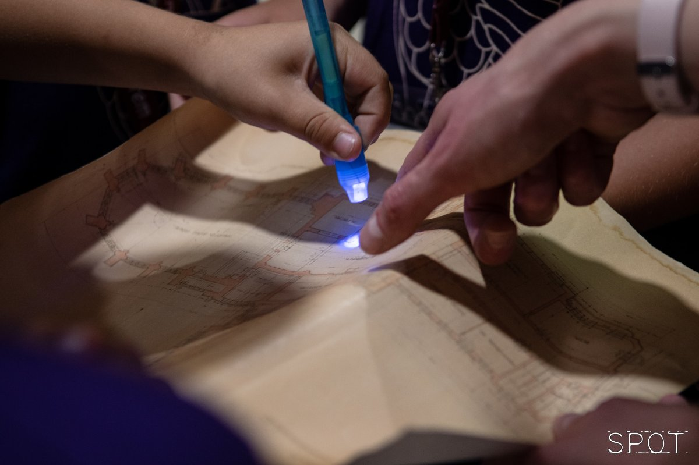

10-12 éves gyerekeknek 

A gyerekek különböző feladatokon keresztül járják be a könyvtárat, ahol minden olvasóterem újabb nyomot rejt. Vajon sikerül megtalálniuk ezek rejtekhelyeit? A gyerekek kisebb csoportban együtt oldják meg a feladatokat, melynek végén az ifjú navigátorok ajándékban részesülnek. A foglalkozást felügyelet mellett végzik. 

Megkérjük a szülőket, hogy a program alatt az aulában tartózkodjanak, vagy érdemes addig más programjainkon is részt venni. Szülők számára ajánljuk a Könyvtártúra és Padlástúra a könyvtárban programjainkat.

