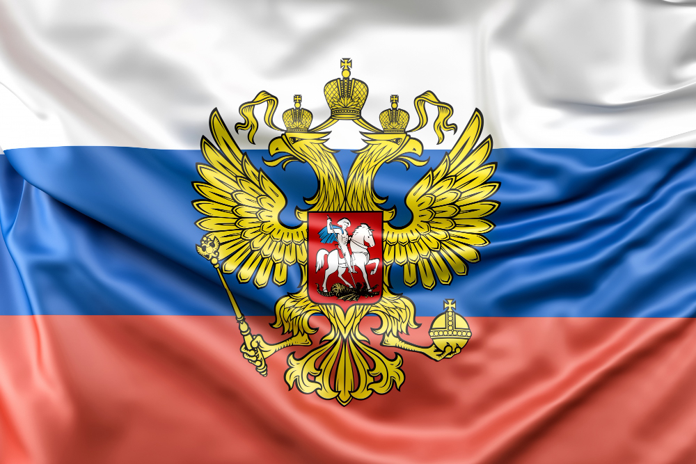

**Dr. Bernek Ágnes**: Geopolitikai elemző, a BME Közgazdaságtan Tanszék geopolitikai oktatója. Kiemelt kutatási témái: a klasszikus geopolitikai fogalmak 21. századi értelmezése, a nagyhatalmak geopolitikai és geoökonómiai stratégiáinak összefüggései, valamint Oroszország geostratégiái a 2000. évtől napjainkig.

**"Prigozsin és a Wagner csoport - háttérelemzés az orosz geopolitikai stratégiák megértéséhez"** Augusztus 23-án, pontosan két hónappal a hivatalosan Prigozsin tulajdonában lévő Wagner csoport katonai puccsa után lezuhant az a magánrepülőgép, amelyen Prigozsin és a Wagner csoport még 9 tagja utazott. Az előadás e hírhez kapcsolódóan bemutatja J. Prigozsin életútját, kapcsolatát V. Putyin elnökkel, elemzi a Wagner csoportot mint magán katonai vállalatot, bemutatja a Wagner csoport aktivitását a különböző országokban, választ keres a Wagner csoport jövőjére, s mindezek alapján értelmezi a jelenlegi orosz geopolitikai stratégiákat.

