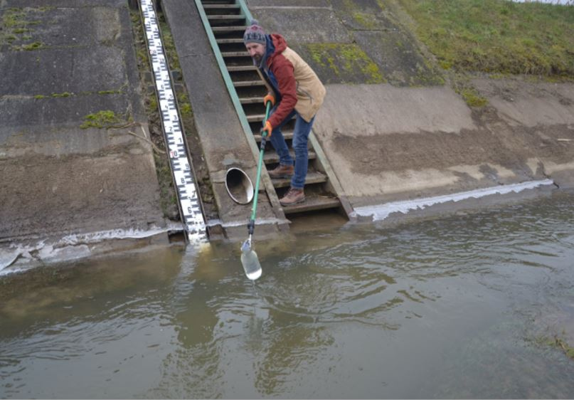

[A BME VKKT munkatársai](https://epito.bme.hu/vkkt/munkatarsak)

Víz-Közmű-Környezet. Mi a kapcsolat? Ha érdekel a válasz, keresd fel a BME Vízi Közmű és Környezetmérnöki Tanszéket, ahol ismét kitárul a laboratórium ajtaja. Felfedjük a környezeti rendszerek közötti kapcsolatot a modellek, kísérletek és technológiai bemutatók során. Légy részese a felfedezésnek!

