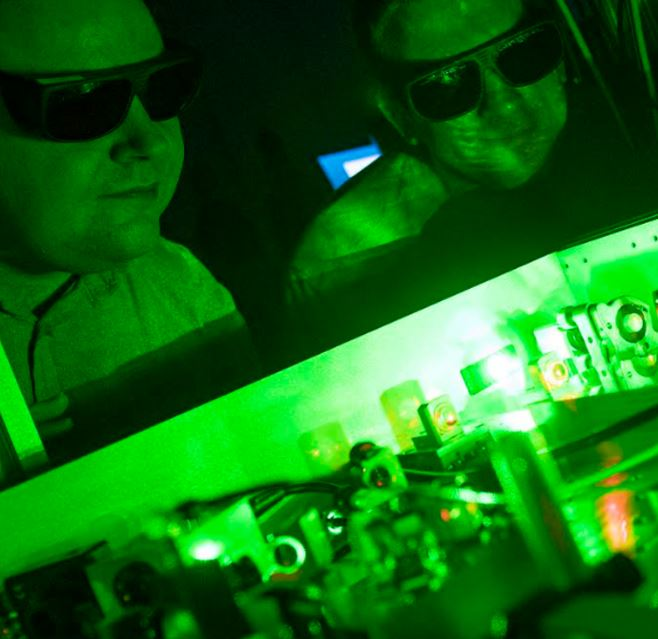

[Dr. Asbóth János](https://dtp.physics.bme.hu/Asboth_Janos), [Dr. Dombi Péter](https://wigner.hu/infopages/dombi.peter)

Mi fán terem a femtokémia és az attofizika? Hogyan tudunk mozifilmet készíteni elektronok főszereplésével? 
Miért éppen ilyen kutatásokért kapott Krausz Ferenc Nobel-díjat? Az előadásban ilyen kérdéseket válaszolok meg és bemutatom a legújabb lézeres kutatásokat.

