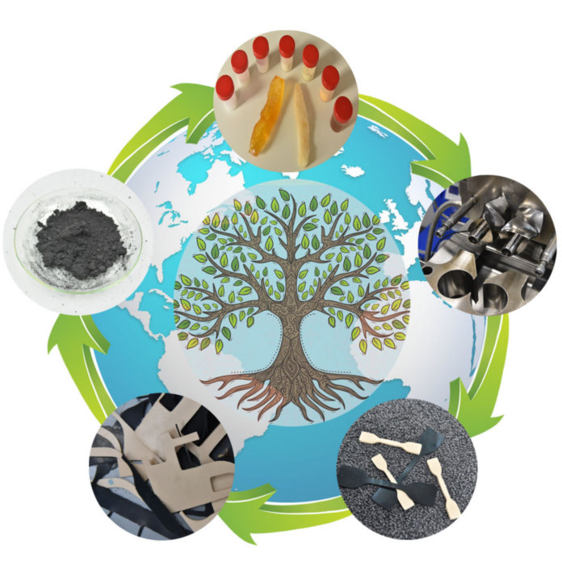

[Görbe Ákos](http://www.pt.bme.hu/munkatarsadatlap.php?id=8z5tj52s7Bt2cB6k55c737672ybk829774gc2rd9&l=m) | [Zelenainé Kohári Andrea](http://www.pt.bme.hu/munkatarsadatlap.php?id=72s794mv2u2s4334p785un64x2xk2g6j2fhum2h5&l=m)
| [Decsi Balázsné Sayfo Petra](http://www.pt.bme.hu/munkatarsadatlap.php?id=bd4z797un73Bzn59zw9py9cm982yr96r86c4o59B&l=m) | [Kiss Lóránt](http://www.pt.bme.hu/munkatarsadatlap.php?id=y3t47s4uoB44mpm2798887922x44df37sk88o69u&l=m)

Az esemény során a látogatók megismerkedhetnek a gumikeverékek előállítási módszereivel, 
emellett kitérünk a gumik anyagában történő újrahasznosítási lehetőségeire a körkörös 
gazdasági szemlélet tükrében. 

