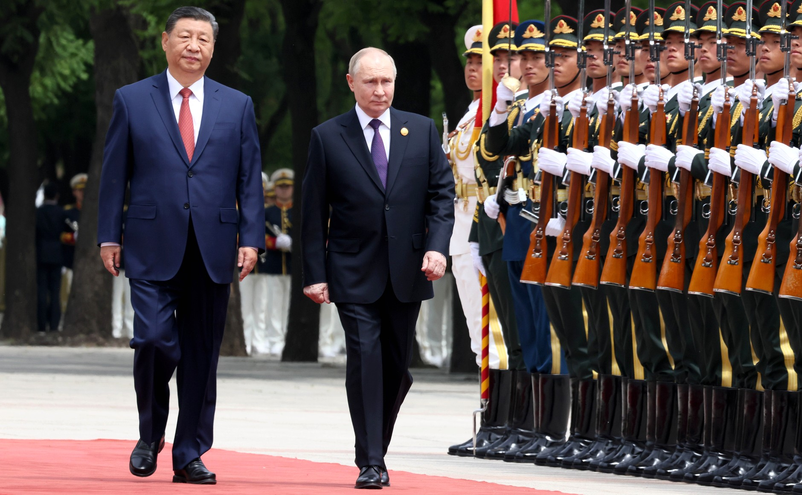

**Dr. Bernek Ágnes** geopolitikai szakértő, a BME Közgazdaságtan Tanszék geopolitikai oktatója. Kiemelt kutatási témái: a klasszikus geopolitikai fogalmak 21. századi értelmezése, 
a nagyhatalmak geopolitikai és geoökonómiai stratégiáinak összefüggései, valamint Oroszország geostratégiái a 2000. évtől napjainkig.

A 21. század elején Oroszországot és Kínát az erős szövetségesi viszony jellemzi, köszönhetően annak, hogy az új többpólusú világrend kialakítása iránt messze legnagyobb mértékben e két ország elkötelezett. 
Ugyanakkor vitathatatlan, hogy igen aszimmetrikusak ezek a kapcsolatok, s Oroszország gazdaságilag nagy mértékben függ Kínától. 
Az előadás bemutatja a két állam közös távol-keleti gazdasági fejlesztési projektjeit is, s majd választ keres arra, hogy a közeljövőben várhatóan hogyan fog formálódni az új többpólusú világgazdasági 
és világpolitikai rendszer. 

