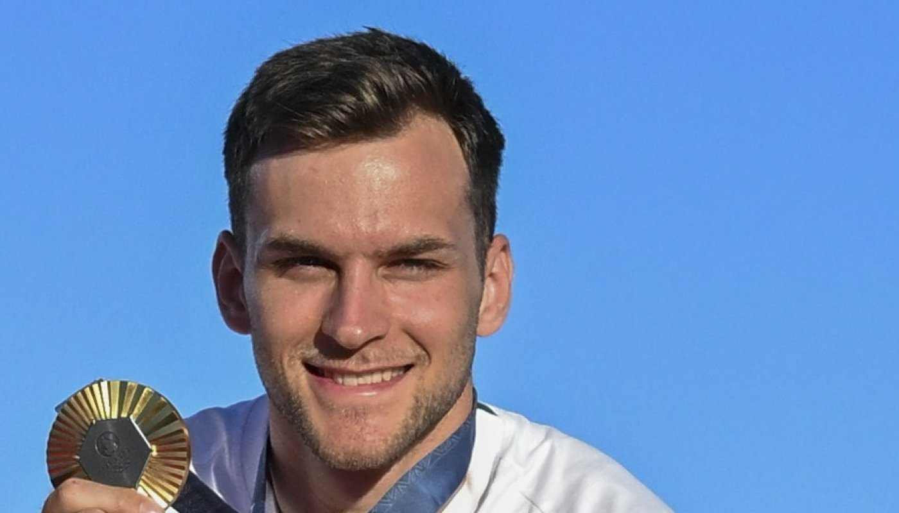

**Dr. Kincses Gábor:** Egyetemi adjunktus, igazgató

**Dr. Koltai Tamás:** Egyetemi tanár, a GTK dékánja

**Nagy Dávid:** GTK gazdálkodás és menedzsment alapszakos hallgató

Nagy Dávid párbajtőröző kerekasztal beszélgetése, aki a Műegyetem 20. olimpiai aranyérmese lett a 2024-es párizsi olimpián

