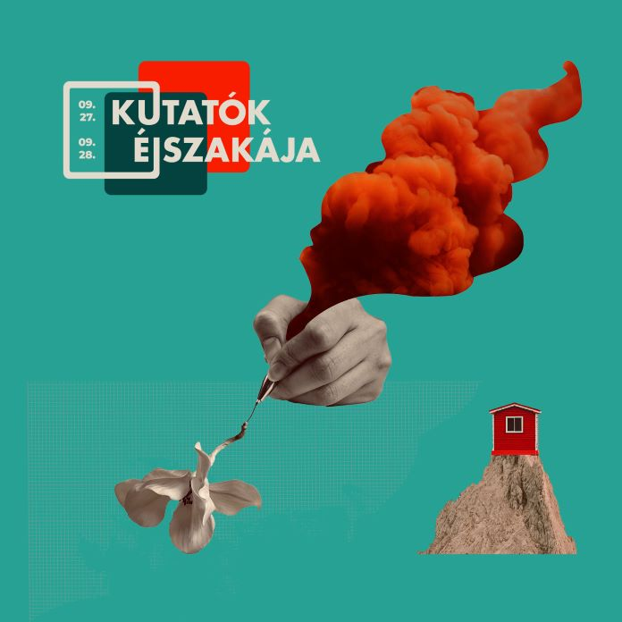

[Dr. Pesznyák Csilla](http://reak.bme.hu/munkatars/oktatok/pesznyak-csilla.html):
Klinikai sugárfizikus és sugárvédelmi szakértő. 2009-től a Nukleáris Technikai Intézet munkatára. Kutatási területe a sugárterápia, sugárvédelem és sugárbiológia. 1995 óta dolgozik orvosi fizikusként, 2011-től az Országos Onkológiai Intézet munkatársa is. Az orvosi fizika MSc oktatója. 

Reaktorok és sugárterápia sugárvédelme - hosszú utat tettünk meg a radioaktivitás felfedezésétől a biztonságos alkalmazásáig. Ma már tudjuk, hogy az ionizáló sugárzás veszélyes lehet, de ez a hőskorban még nem volt nyilvánvaló. A biztonságért folytatott küzdelem történetéről szól az előadás.

