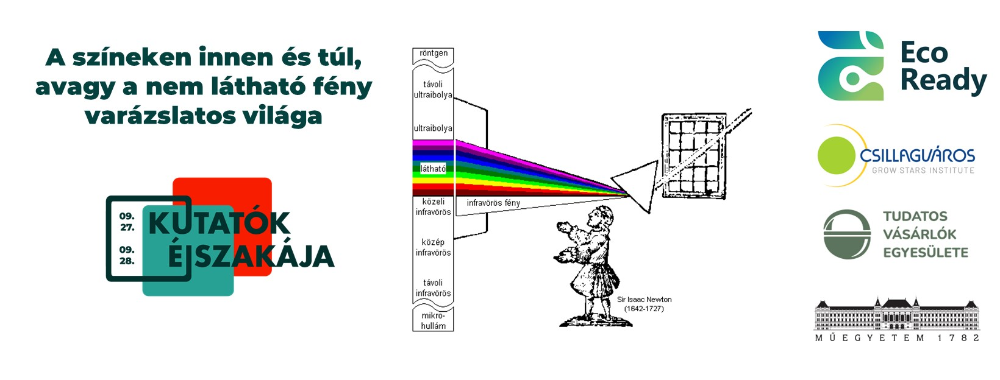

**Dr. Gergely Szilveszter**, a BME Alkalmazott Biotechnológia és Élelmiszertudományi Tanszékének docense. Fő kutatási területe a közeli és analitikai infravörös spektroszkópia és mikroszkópia, különös tekintettel a sokváltozós adatelemzésre. Kutatási témái – a BME hagyományait követve – számos ponton kapcsolódnak a hazai ipar és mezőgazdaság különböző szegmenseihez ott, ahol a gyors, roncsolásmentes infravörös technikákra és a tudásintenzív megoldásokra szükség van. [További érdekességek](https://eviko.hu/index.php/eviko/article/view/103/155)

**Slezsák János**, a BME Alkalmazott Biotechnológia és Élelmiszertudományi Tanszékének tanársegéde. Kutatásainak fókuszában az infravörös spektroszkópia minőségirányítási alkalmazásainak fejlesztése áll az ipari folyamatok nyomonkövetésével és a végtermékminősítéssel kapcsolatosan, a minőségi és mennyiségi elemzések terén egyaránt.

**Madács Ágnes**, a BME Alkalmazott Biotechnológia és Élelmiszertudományi Tanszékének ösztöndíjas kutatója. Kutatásai elsősorban növényi eredetű minták infravörös spektroszkópiai és mikroszkópos vizsgálataira irányulnak, melyek segítségével nem csak az élelmiszerlánc, hanem a gyógyszeripar számára is gyors, roncsolásmentes vizsgálatok biztosítására adódik lehetőség.

[**Prof. Salgó András**](https://mta.hu/koztestuleti_tagok?PersonId=9756 ), a BME Alkalmazott Biotechnológia és Élelmiszertudományi Tanszékének professor emeritus-a. 50 éve a tanszék dolgozója, a NIR Spektoszkópia Csoport megalapítója. Oktatási tevékenysége keretében több tantárgy és képzési forma kidolgozója, előadója mind a mai napig (pl.: Élelmiszerkémia és táplálkozástan, Közeli infravörös spektroszkópia alapjai és ipari alkalmazásai, Táplálkozás biokémia és dietetika, Élelmiszeranalitika c. tárgy egyes fejezetei). 

Tudtad, hogy a fehér fényben van a legtöbb szín? És hogy mi van ott, amit nem látunk, a vörös alatt és az ibolyán túl? Elég jó a szemed, hogy lásd az árnyalatnyi különbségeket? És ha elfárad, hogy látnak a gépek helyetted? A színeken inneni és túli világokat is bemutatjuk olyan példákon keresztül, ami minden nap körülvesz - hogy láss, ne csak nézz.

**Laborlátogatás** keretében a műszaki és a természettudományok (fizika, kémia, biológia és matematika) metszetében mutatjuk be a látható (Vis), a közeli és középinfravörös (NIR és MIR), valamint az ibolyántúli (UV) tartomány alkalmazhatóságát. Egyszerű, a résztvevők által is elvégezhető **kísérlet**ekkel szemléltetjük, hogyan működik a távirányító (NIR), hogyan ellenőrizhető a bankjegyek és a tabletták eredete (UV), hogyan bontja fel a fehér fényt a prizma, ill. szűrhető ki egy-egy szín (Vis). **Bemutató** jelleggel infravörös spektroszkópiai mérések végezhetők sokváltozós adatelemzéssel készült matematikai modellekkel például különböző magvak (búza, kukorica) fő alkotóinak (keményítő-, fehérje-, nedvesség-, olajtartalom) mennyiségi meghatározására (NIR), miközben a mikroszkóppal szövet, sejt szinten történhet képalkotás (Vis/NIR/MIR). **Kreatív foglalkozás** során színsorokat kell megfelelő sorrendbe tenni (például modellezve a növényi olajokat, színanyagokat) és színtévesztő teszteket lehet elvégezni (Vis). Kutatócsoportunk az EcoVita Living Lab keretén belül a Csillagváros Kft.-vel és a Tudatos Vásárlók Egyesületével együttműködve szolgálja a tudományos szféra, az ipar és a civil társadalom kapcsolódását. Az EcoVita Living Lab  - [https://www.eco-ready.eu/living-labs/ecovita/](https://www.eco-ready.eu/living-labs/ecovita/) - azt vizsgálja, hogy a vertikális gazdálkodás, mint a mezőgazdaság sajátos formája hogyan járulhat hozzá az élelmezésbiztonsághoz, az éghajlatváltozással szembeni ellenálló képességhez és az agrobiodiverzitáshoz. Célja az élelmiszerrendszer szisztematikus és gyakorlatorientált jellemzése, valamint a meglévő struktúrával kapcsolatos hiányosságok és adatigények elemzése, erősítve a fenntarthatóság társadalmi-gazdasági és környezeti pilléreit. (Az ECO-Ready projekt az Európai Unió HORIZON-CL6-2022 kutatási és innovációs programjából kapott támogatást a No. 101084201 számú támogatási megállapodás alapján.)

*A program a 2019-1.3.1-KK-2019-00004 számú projekt a Nemzeti Kutatási Fejlesztési és Innovációs Alapból biztosított támogatással, a 2019-1.3.1-KK pályázati program finanszírozásában valósult meg.* 

Az esemény a BME Alkalmazott Biotechnológia és Élelmiszertudományi Tanszékén megrendezésre kerülő ["Legyél te is biomérnök!"](https://kutatok.org/abettt/2024/09/04/kutatok-ejszakaja-2024-legyel-te-is-biomernok-programsorozat/) programsorozat része.

**A rendezvény nem regisztrációköteles. A laboratórium befogadóképessége kb. 15 fő.**

