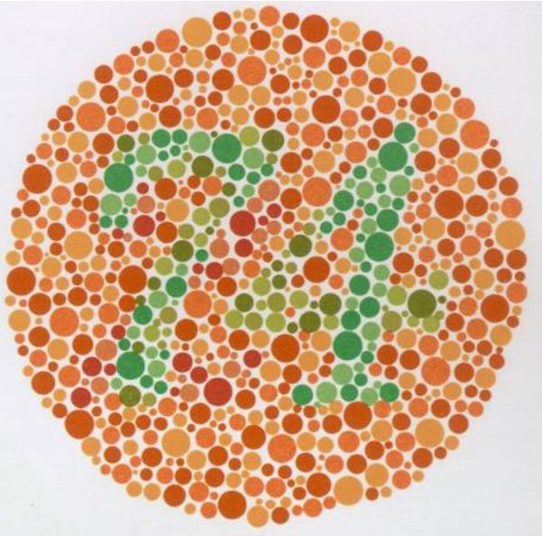

**Dr. habil Ábrahám György professor emeritus:** A műszaki optika professzora, fő kutatási területe az emberi színlátás 

Vetített képes előadás az emberi látásról, a színlátásról és a színtévesztésről. Magyar világszabadalom lett a színtévesztés korrigálása színszűrős szemüvegekkel. 
Az előadás a feltaláló szmélyes élményeivel ismerteti meg a hallgatóságot a találmány születéséről és a megoldás lényegéről.

