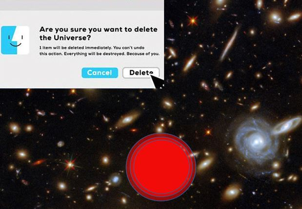

[Dr. Asbóth János](https://dtp.physics.bme.hu/Asboth_Janos), [Dr. Takács Gábor](https://dtp.physics.bme.hu/Takacs_Gabor)

Történhet-e bármi érdekes az üres térben?

A fizikusok időről időre kitalálnak egy új módszert az Univerzum elpusztítására, mint például a Hőhalál és a Nagy Reccs, de egyik sem érhet a vákuum-bomlás nyomába, 
ami egy gyors, tiszta és hatékony módja az Univerzum eltörlésének.

