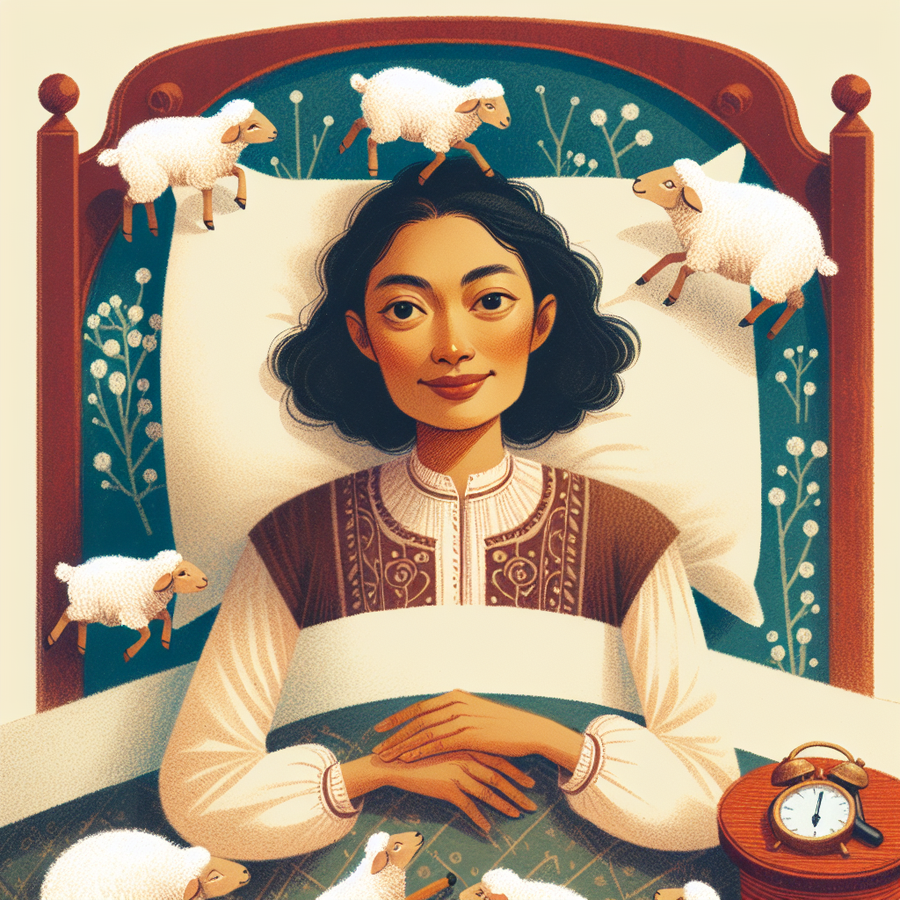

**Báthori Noémi** a kognitív tudományi tanszék munkatársa. Fő érdeklődési területei az alvás, az alváskutatás.

Az alvás és a mentális jóllét  kapcsolatát rengeteg kutatás vizsgálata általánosságban. De hogy látjuk jelenleg? Vajon az alvás  csak egy kapcsolódó tünet vagy a kiváltó ok, esetleg egy protektív faktor az aktuális mentális jóllét vagy problémák esetében?

