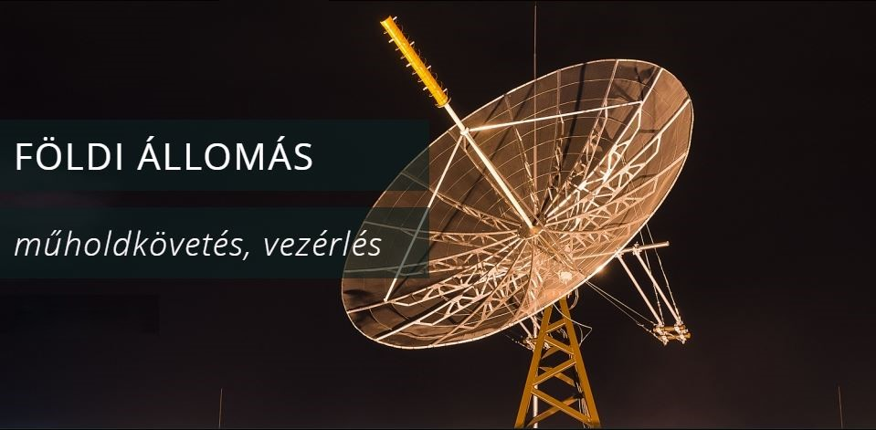

Az előadók a BME diákműhold fejlesztő csoport, valamint a [Műegyetemi Rádió Club](https://ha5mrc.bme.hu/mobil/) tagjai.

A minden egész órakor induló max. 12 fős csoportok egy-egy 45 perces időintervallumban látogatást tesznek a **BME E épület tetején található műholdvezérlő földi állomáson**, ahol megismerkednek az eddig fejlesztett műegyetemi diákműholdakkal valamint a hozzá tartozó földi vevő és vezérlő állomással.

[További információ>>](https://gnd.bme.hu/index.php)

