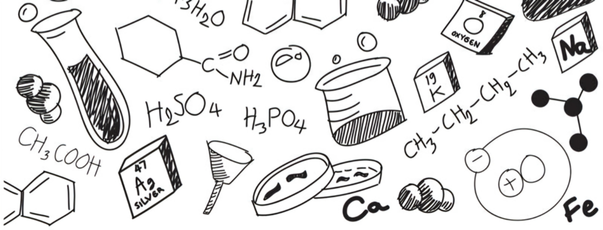

[A Szakkollégium tagjai>>](https://tudprog.bme.hu/kutatok_ejszakaja/profilok/szent_gyorgyi_albert_tagok)

Lelkesen állunk a rendezvény megszervezéséhez. Csapatunk szeretné minél szélesebb körben népszerűsíteni a kémiát és a tudományokat.

