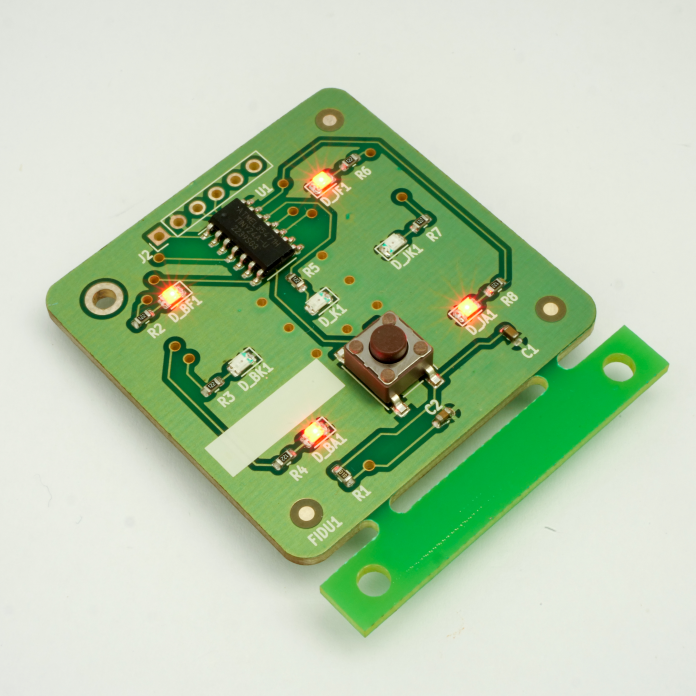

**Bátorfi Réka** a BME Elektronikai Technolgóia Tanszék tudományos segédmunkatársa, kutatási területei többek között az ón tűkristályok. Alkalmazott mérnöki tapasztalata a teljes elektronikai gyártás lépéssorozatára kiterjed. Réka a tanszék nagykövete az egyetem Lányok Napja programsorozatában.

**Takács Gergő** a BME Elektronikai Technolgóia Tanszék tanszéki mérnöke. Szakterülete az elektronikai gyártástechnológiák és a minőségi vizsgálatok.

**Havellant Gergő** a BME Elektronikai Technológia Tanszékének MsC hallgatója. Érdeklődési területei a mikrovezérlőkkel megvalósított komplett készülékek és mérőrendszerek; az elektronikai szereléstechnológiák. TDK kutatás keretében foglalkozott textil maszkok szűrőképességének vizsgálatával.

Elgondolkodtál már azon, hogy készülnek az elektronikus áramkörök? Hogyan készül a mobiltelefon vagy a mosógép vezérlőlapja? Akkor itt a helyed nálunk! A program során bemutatjuk egy egyszerű áramkörrel, hogyan épül fel a felületszerelési technológia, hogyan lesz a sok bezacskózott alkatrészből a végén egy működő villogó digitális dobókocka!

**Fontos!** *A helyszíni regisztráció a V1 épület aulájában történik. A látogatókat minden óra egészkor engedjük be a laboratóriumba. Egy turnusban maximum 25 fő vehet részt. Amennyiben valaki nem fér be az adott turnusba, a következő turnusban elsőbbséget élvez.*

