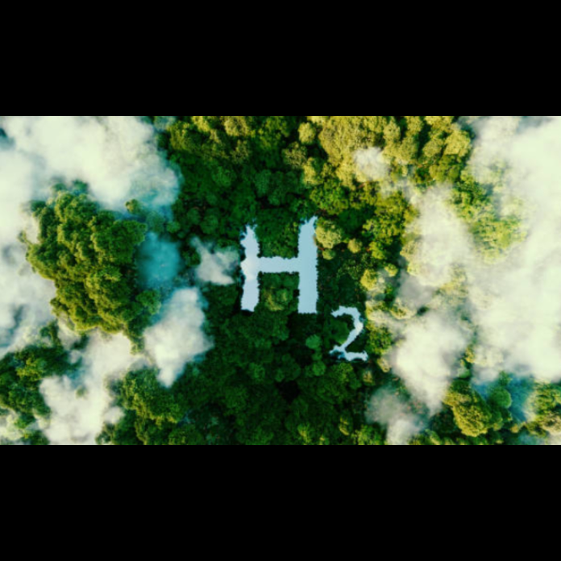

[A BME Energetikai Gépek és Rendszerek Tanszék munkatársai](http://www.energia.bme.hu/munkatarsak/)

Fedezd fel a hidrogéncellák izgalmas világát! Tanulj meg mindent arról, hogyan alakítják át a hidrogént tiszta, hatékony üzemanyaggá, és tudd meg, hogyan járulhatnak hozzá a fenntartható jövőhöz!

