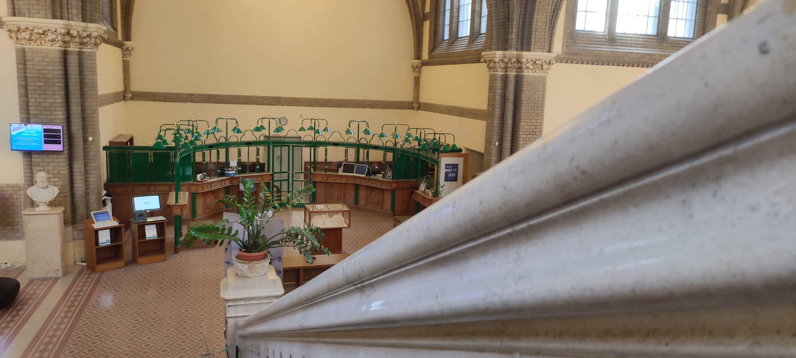

Önállóan megfejthető nyomkeresős feladatok, melyeket a családok vagy barátok is közösen játszhatnak. 
A játékosok a játék során megismerhetik a könyvtár olvasótermeit és betekintést nyerhetnek a könyvtár történetébe is.
A játék korosztálytól független, felnőttek is játszhatják, azonban a feladatok megfejtéséhez alapvető olvasási és számolási készségek szükségesek, 
így 8 éves kortól ajánlom. 

*A játék nagyjából 1 óra időtartamú.*

