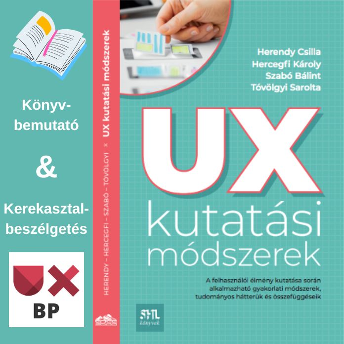

[Dr. Herendy Csilla](https://tudprog.bme.hu/kutatok_ejszakaja/profilok/herendy_csilla),
[Dr. Hercegfi Károly](https://tudprog.bme.hu/kutatok_ejszakaja/profilok/hercegfi_karoly),
[Dr. Szabó Bálint](https://tudprog.bme.hu/kutatok_ejszakaja/profilok/szabo_balint),
[Dr. Tóvölgyi Sarolta](https://tudprog.bme.hu/kutatok_ejszakaja/profilok/tovolgyi_sarolta)

Elkészült az a „UX kutatási módszerek“ c. könyv, amely tudományos megalapozottsággal mutatja be a felhasználói élmény (UX) fogalmát és módszereit. A könyvbemutató során egy izgalmas szerzői kerekasztal beszélgetésre is sor kerül a UX Budapest meetup csoport szervezői által moderálva.

