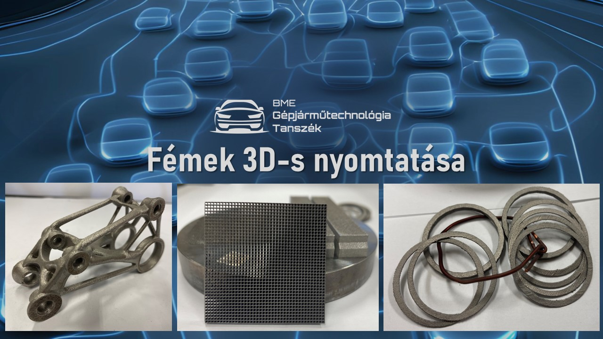

**Dr. Markovits Tamás** a Budapesti Műszaki és Gazdaságtudományi Egyetem Közlekedésmérnöki és Járműmérnöki Karának Gépjárműtechnológia Tanszékének Tanszékvezető helyeteseként  dolgozik. Az egyetemen oktató és kutató munkát végez.

**Varga Ferenc László** a Budapesti Műszaki és Gazdaságtudományi Egyetem Közlekedésmérnöki és Járműmérnöki Karának Gépjárműtechnológia Tanszékén doktorandusz hallgatóként dolgozik. Az egyetemen oktató és kutató munkát.

Egy korszerű megmunkálási eljárás kerül bemutatásra: porágyas lézersugaras fém nyomtatás, gyártás folyamata és nyomtatott modellek.

