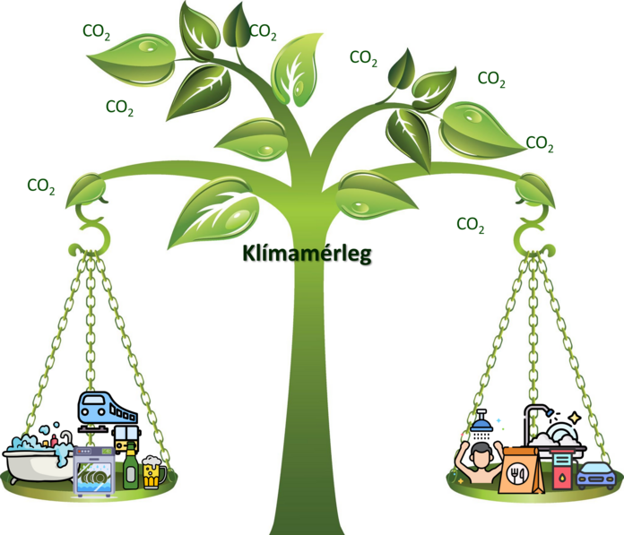

[A BME Energetikai Gépek és Rendszerek Tanszék munkatársai](http://www.energia.bme.hu/munkatarsak/)

Kíváncsi vagy a mindennapi életed klímaváltozásra gyakorolt hatására? Az Életciklus szemlélet segítségével megismerheted a hétköznapjaid CO2 lábnyomát, a háztartási berendezéseid, az otthoni szórakozásod, vagy akár az ételrendelésed környezetterhelését.

