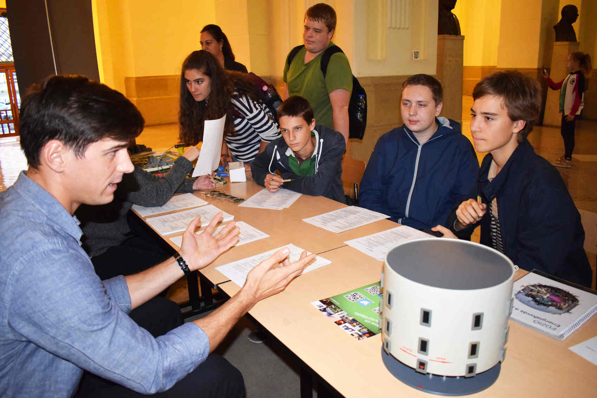

[Dr. Orosz Gergely Imre](https://tudprog.bme.hu/kutatok_ejszakaja/profilok/orosz_gergely_imre)

A FINE a Kutatók Éjszakáján minden érdeklődő korosztálynak igyekszik kielégíteni a kíváncsiságát. Az idei évben mi is igyekszünk a BME főépületének aulájában megvalósítani programjainkat. A jól ismert nukleáris tudományok tematikáját érintő kvízeink kitöltésért apróbb ajándékok nyerhetők. A kvízeket minden esetben közösen átbeszéljük, így senki sem szokott tőlünk megválaszolatlan kérdésekkel távozni. 
A fiatalabb korosztályok körében a 3D- nyomtatott makettjeink igazán sikeresek. A makettek különböző atomerőművi blokkokok konstrukcióját mutatják be. Az egyszerűsített makett összerakása közben játszva tanulhatják meg az erőmű működésének és biztonsági filozófiájának alapelveit. 
A radioaktivitás szemléltetésére apróbb, de annál látványosabb kísérleteket fogunk bemutatni, mellyel közelebb hozható a laikusok számára is, ez a talán ijesztőnek ható tudományág. 

