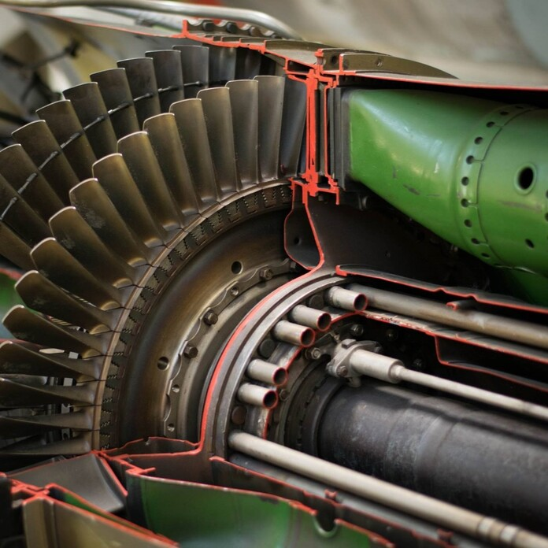

[A BME Energetikai Gépek és Rendszerek Tanszék munkatársai](http://www.energia.bme.hu/munkatarsak/)

Merülj el a gázturbinák világában, ahol a szárazföldi energiatermelés és a repülés találkozik! A kiállított és működő turbináink segítségével megismerheted a technológia működését, fejlesztéseit és hatását a modern energiagazdálkodásra és légiközlekedésre.

