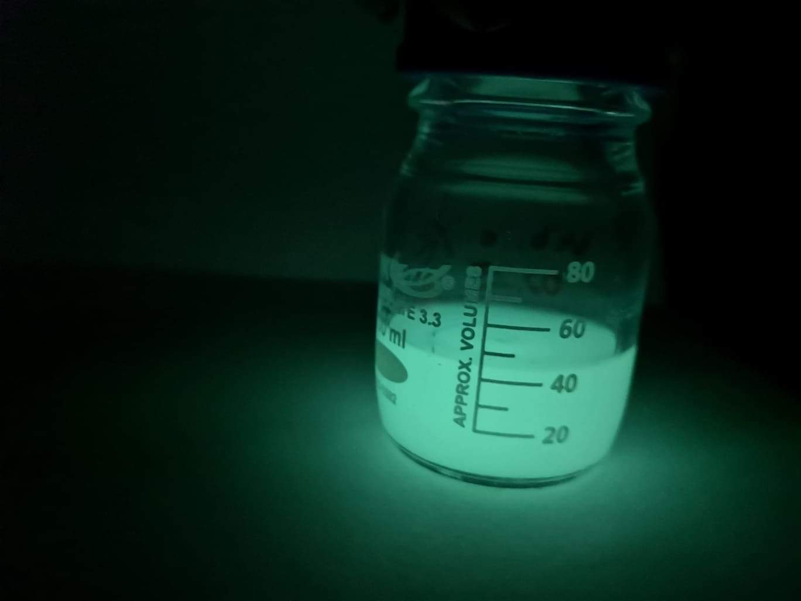

[Dr. Feigl Viktória](https://tudprog.bme.hu/kutatok_ejszakaja/profilok/feigl_viktoria_dora), [Dr. Molnár Mónika](https://tudprog.bme.hu/kutatok_ejszakaja/profilok/molnar_monika), 
[Dr. Fekete-Kertész Ildikó](https://tudprog.bme.hu/kutatok_ejszakaja/profilok/fekete_kertesz_ildiko), [Márton Rita](https://tudprog.bme.hu/kutatok_ejszakaja/profilok/marton_rita), 
[Berkl Zsófia](https://tudprog.bme.hu/kutatok_ejszakaja/profilok/berkl_zsofia)

Hogyan beszélgetnek egymással a mikróbák? Mit látunk a mikroszkópban? Jól mozog a bolharák, ha boldog? Mit lehet kiszedni mikróbákkal hulladékokból? Gyere, és ismerd meg a BME Környezeti Mikrobiológia és Környezettoxikológia laboratoriumának titkait!

Az esemény a BME Alkalmazott Biotechnológia és Élelmiszertudományi Tanszékén megrendezésre kerülő ["Legyél te is biomérnök!"](https://kutatok.org/abettt/2024/09/04/kutatok-ejszakaja-2024-legyel-te-is-biomernok-programsorozat/) programsorozat része.

