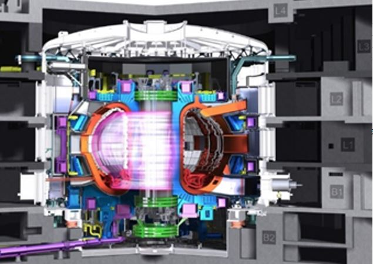

[Asztalos Őrs](https://tudprog.bme.hu/kutatok_ejszakaja/profilok/asztalos_ors)

Az energiaigény növekedésével, és a fosszilis energiahordozók végességének tudatával az emberiség komoly kihívások elé néz energetikai téren. Az egyik lehetséges megoldás az úgynevezett magfúzió, az a folyamat, amellyel a csillagok termelik az energiát, így a mi Napunk is.

