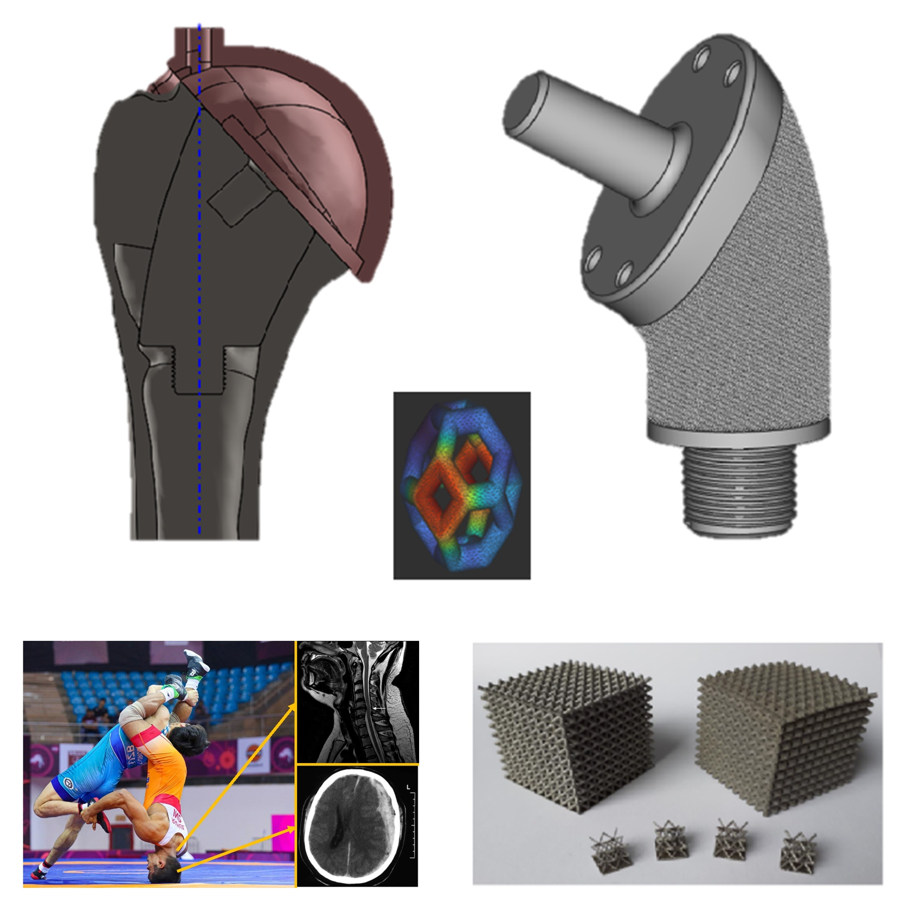

[Tomin Márton](http://www.pt.bme.hu/munkatarsadatlap.php?id=5d6q84jc5cbz83n5s2er385v647s56o44n57mg46&l=m), 
[Nemes-Károly István ](http://www.pt.bme.hu/munkatarsadatlap.php?id=725cAB3m2z29r2q38472d978Bz8u8n3uvh435758&l=m),
[Hajagos Szabolcs](http://www.pt.bme.hu/munkatarsadatlap.php?id=43yo7A89r5u8su4ubkyhp25y29ws68Brpz8246c9&l=m)

Hogyan javítják az orvostechnikai fejlesztések, különösen az ízületi implantátumok, a betegek életminőségét? Mi történik a revíziós úton eltávolított implantátumokkal? Gyere és el ismerd meg a biomechanikai vizsgálatok szerepét az eszközfejlesztésben és a sportsérülések megelőzésében!

