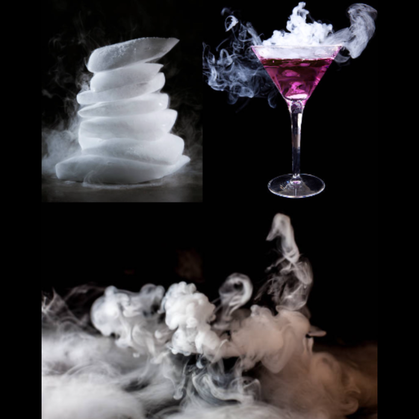

[A BME Energetikai Gépek és Rendszerek Tanszék munkatársai](http://www.energia.bme.hu/munkatarsak/)

Fedezd fel a hűtéstechnika csodáit izgalmas kísérletek során! A programon választ kaphatsz arra, hogy hogyan lehet irányítani a hőmérsékletet különböző technikai megoldásokkal. Tudd meg, hogyan hűsít a tudomány!

