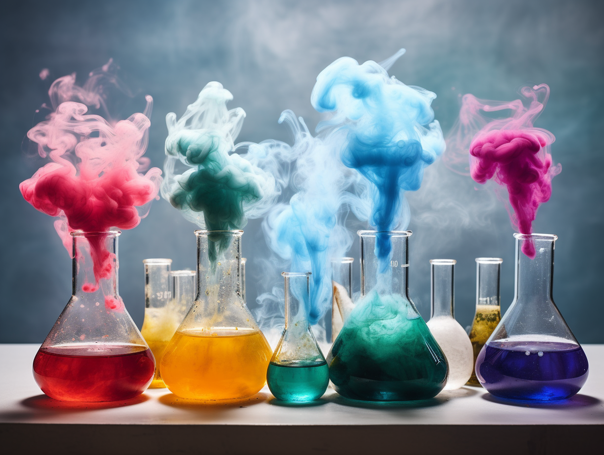

[*Lágy Anyagok Kutatócsoport>>*](https://softmatters.bme.hu/)

**Mihalovics Bence:** Elsőéves PhD hallgató vagyok. Az alap és mesterképzésemet is a BME VBK-n végeztem vegyészmérnökként, gyógyszervegyész specializáción. Bár gyógyszeresként végeztem a polimer oldatokat jobban szeretem.

**Nguyen Zsófia Ly:** MSc-s vegyészmérnök hallgató vagyok és több mint 2 éve végzek kutatómunkát a Lágy anyagok Kutatócsoportban. Kedvelem a látványos kísérleteket.

**[Stankovits József Gergely:](https://softmatters.bme.hu/munkatarsak/gstankovits)** Szívemnek kedves a kutatói pálya, jelenleg  tanársegéd és doktorvárományos vagyok. 
Kifejezetten szeretem a „fura állagú" anyagokat. Kutatási témám a különböző gyógyszerformák nyálkahártyán való megtapadásának értelmezése. 

**Szabó Domonkos:** Harmadéves PhD hallgató vagyok. Az alapképzésemet az ELTE TTK-n, a mesterképzésemet a BME VBK-n végeztem, anyagtudományi specializáción. Kedvenc italom a folyékony nitrogénnel hűtött kávé.

**Szayly Kata:** MSc-s vegyészmérnök hallgató vagyok, emellett több mint 2 éve végzek kutatómunkát a Lágy anyagok Kutatócsoportban. Szeretem a labromunka "színes-szagos" részét.

**Látványos, szórakoztató kísérletektől egészen a gyakorlati alkalmazásig szemléltetünk különböző környezeti hatásra választ adó intelligens anyagokat. Ezek között láthatnak szuperabszorbens vízmegkötőket, Nem-Newtoni folyadékokat, és sok mást. A programot egyéb kísérletek színesítik.**

