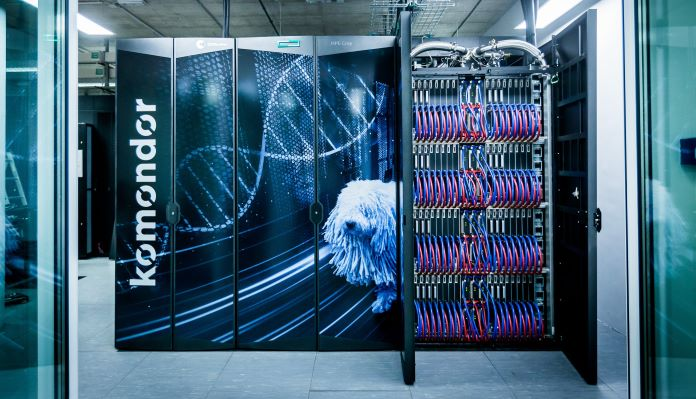

[Csippa Benjamin](https://www.hds.bme.hu/tanszek.php?sm=2&lang=HU), egyetemi adjunktus, a Kormányzati Informatikai Ügynökség KIFÜ munkatársa

**Friedrich Péter**, a Kormányzati Informatikai Ügynökség KIFÜ munkatársa

Mi is a szuperszámítógép? Hogyan lett a tudomány és az innováció nélkülözhetetlen eszköze? Mire használják a biológusok, kémikusok, fizikusok és mérnökök? Milyen lehetőségeket tartogat a Komondor, a magyar szuperszámítógép?
Ismerd meg a szuperszámítógépek világát, az elképesztő teljesítményt és a legújabb magyar szupergépet! 

