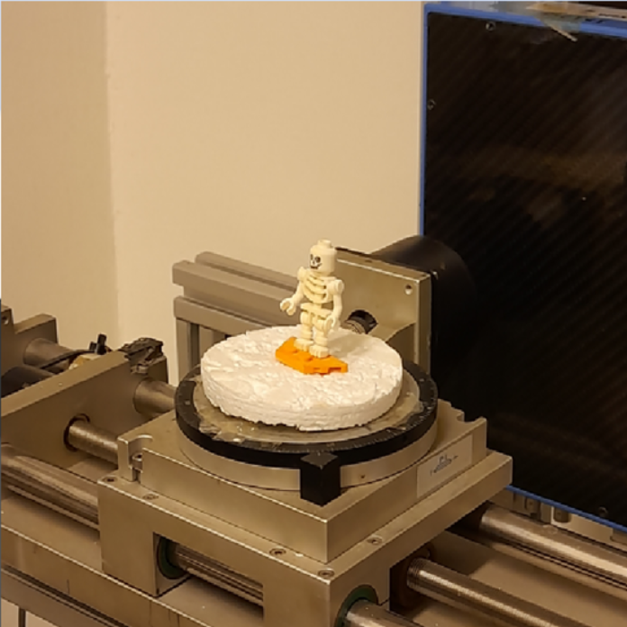

**Sudár Ákos** Ph.D. hallgatóként tanul a BME-n, emellett orvosi fizikusként dolgozik az Országos Onkológiai Intézetben. A CT képalkotással a mesterképzés során ismerkedett meg közelebbről, az azóta eltelt években pedig beleásta magát a technológiába a képrekonstrukciós algoritmus fejlesztésétől egészen a CT berendezések minőségbiztosításáig. 

A laborlátogatás során a BME mikro CT berendezésén követhetjük nyomon lépésről-lépésre a képalkotás folyamatát. A berendezés különlegessége, hogy hallgatók tervezték és írták a képalkotást vezérlő, valamint a térbeli képet rekonstruáló szoftvert.

