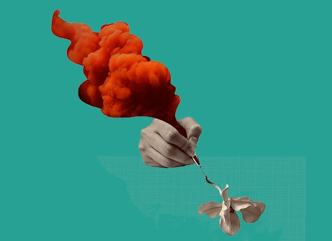

[Dr. Pesznyák Csilla](http://reak.bme.hu/munkatars/oktatok/pesznyak-csilla.html)

**Koszta Enikő** a BME Nukleáris Technikai Intézetének doktorandusza és az Országos Onkológiai Intézet orvosi fizikusa. Szenvedélye a mágneses rezonancia. És a csokoládé.

CT és MR - minek a rövidítése és főleg hogyan működik? Vajon könnyű felismerni jól ismert dolgok részleteit az MR felvételeken? A közönség kipróbálhatja magát, és a legügyesebb radiológusok talán még egy kis édességhez is hozzájuthatnak. Az előadás vegetáriánus...

