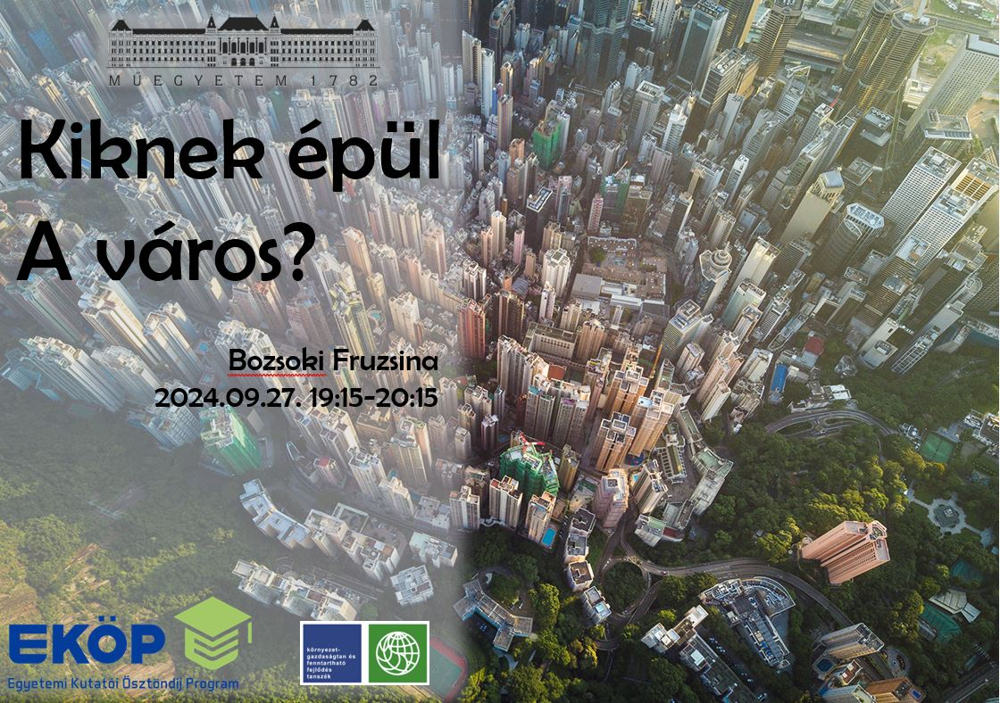

**Bozsoki Fruzsina** alapképzését tekintve környezetmérnök, mestertanulmányait a BME GTK regionális és környezeti gazdaságtan mesterképzésén végezte, jelenleg a Budapesti Műszaki és Gazdaságtudományi Egyetem Környezetgazdaságtan és Fenntartható Fejlődés Tanszékének PhD hallgatója, kutatója. Kutatási témái a városi barnamezős területek revitalizációja és a városi fenntarthatóság. A 2024/2025-ös tanévben Egyetemi Kutatói Ösztöndíj Program ösztöndíjas.
[További információ>>](http://kornygazd.bme.hu/hu/munkatarsak/bozsoki-fruzsina)

Hogyan működnek városaink? Hogyan formáljuk őket? Miért fontos a városfejlesztés tudománya napjainkban? 
Biztos mindenkinek van átélt vagy hallott tapasztalata az egyes fejlesztésekről, vagy azok hiányáról. Nézzünk a kulisszák mögé!

