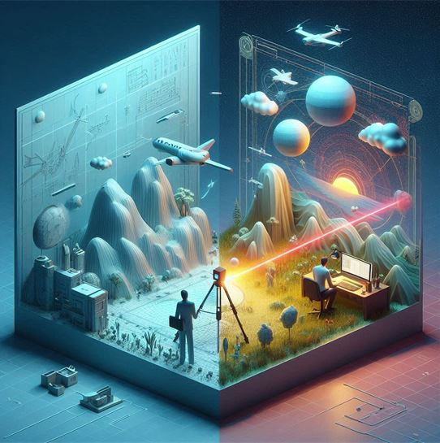

[Dr. Potó Vivien](https://epito.bme.hu/poto-vivien), [Baranyai Dániel](https://epito.bme.hu/baranyai-daniel), [Nagy Zoltán](https://epito.bme.hu/nagy-zoltan )

A résztvevők megismerkedhetnek a lézerszkennelés izgalmas világával. Bemutatjuk,
hogyan készíthetünk 3D-s felvételeket a környezetünkről, és megvizsgáljuk, miként segít a technológia a természet és épületek pontos megfigyelésében.

