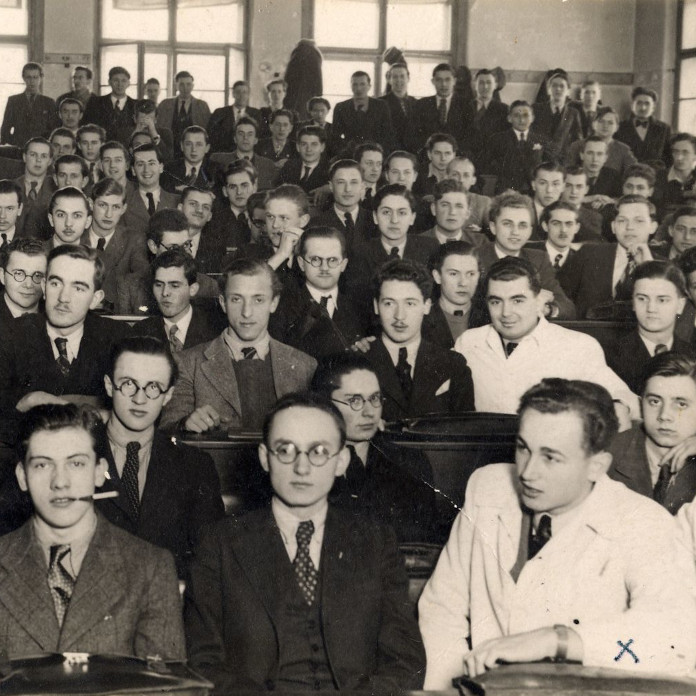

Egyre többen keresik levéltárakban őseik nyomát, közte azt is, hol és hogyan töltötték fiatalkorukat. A Műegyetem levéltárában az 1870-es évektől kezdve találhatók meg a valaha itt tanuló diákok különböző tanulmányi nyilvántartásai és egyéb, rájuk vonatkozó iratok (pl. ösztöndíjak). A hozzánk látogatók ezen az estén megismerhetik hol tároljuk ezeket a dokumentumokat, hogyan lehet bennük keresni, milyen adatok mely korlátozásokkal ismerhetők meg. Aki némi alapinformációval érkezik mérnök felmenőjéről, segítségünkkel megkeresheti nyomát a több mint 1,5 kilométernyi iratállományunkban. 

