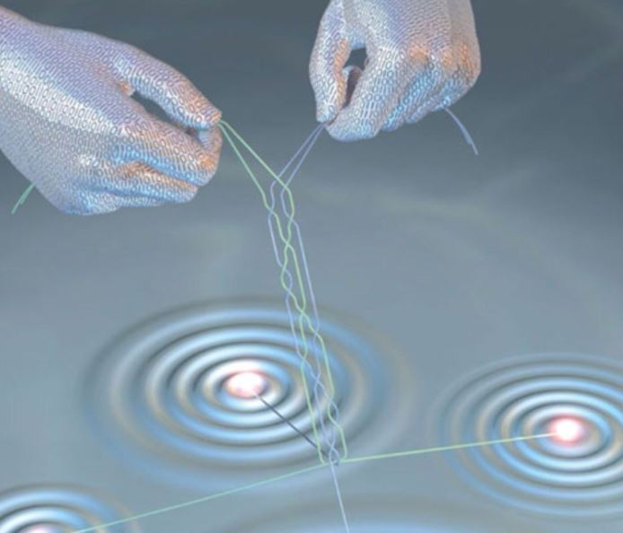

[Dr. Asbóth János](https://dtp.physics.bme.hu/Asboth_Janos)

Mik azok a fránya kvantumhibák,
amik a kvantumszámítógépek működését olyan nehézzé teszik?
És hogyan segít a kvantumos összefonódás az ellenük való harcban? Hogyan kapcsolódnak a kvantumos hibajavítás kutatásához a magyar kutatók? 

