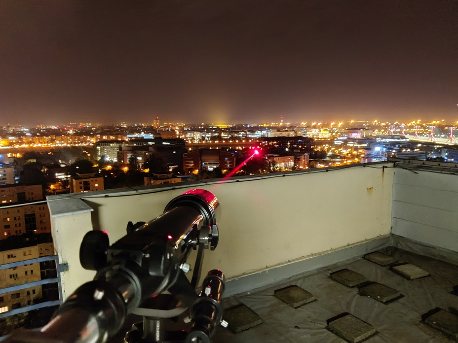

**Dr. Schranz Ágoston Kristóf** villamosmérnök, egyetemi adjunktus. Fő kutatási területe az optikai elvű kvantum-véletlenszámgenerálás.

Az információ biztonságos továbbítását biztosító kvantumkommunikációs rendszerek működésének alapját bonyolult elméletek igazolják. Célunk közérthetően, látványos kísérletekkel közelebb hozni a kvantumkommunikáció világát az érdeklődőkhöz. A bemutató során saját fejlesztésű kvantumos elvű kulcsszétosztó berendezéseket és véletlenszámgenerátort mutatunk be. Kíváncsi vagy, hogyan lehet összefonódott fotonpárokat megosztani a Duna fölött? Vagy kvantumos információt küldeni egy optikai hálózaton? Laborunkban megtudhatod. 

