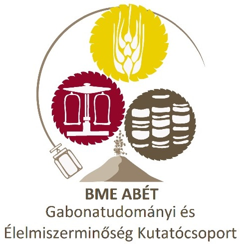

[Dr. Jaksics Edina](https://tudprog.bme.hu/kutatok_ejszakaja/profilok/jaksics_edina), [Muskovics Gabriella](https://tudprog.bme.hu/kutatok_ejszakaja/profilok/muskovics_gabriella), 
[Pisch Barnabás](https://tudprog.bme.hu/kutatok_ejszakaja/profilok/pisch_barnabas),[ Sznopka Liliána](https://tudprog.bme.hu/kutatok_ejszakaja/profilok/sznopka_liliana), [Gasparics Kata](https://tudprog.bme.hu/kutatok_ejszakaja/profilok/gasparics_kata), 
[Szűcsné Makay Erika](https://tudprog.bme.hu/kutatok_ejszakaja/profilok/szucsne_makay_erika), [Dr. Tömösközi Sándor](https://tudprog.bme.hu/kutatok_ejszakaja/profilok/tomoskozi_sandor)

Mit csinál egy élelmiszerkutató? Sok más egyéb mellett alaposan utánajár annak, hogy miből készülnek az élelmiszerek, amiket megeszünk, mi befolyásolja alapanyagaink minőségét és biztonságát, kitalálja, hogyan lehet elérni egy-egy kívánt terméktulajdonságot, és még sok minden mást. Gyere el laborlátogatásunkra, és ismerkedj meg munkánkkal testközelből!

Az esemény a BME Alkalmazott Biotechnológia és Élelmiszertudományi Tanszékén megrendezésre kerülő [“Legyél te is biomérnök!”](https://kutatok.org/abettt/2024/09/04/kutatok-ejszakaja-2024-legyel-te-is-biomernok-programsorozat/
) programsorozat része.

