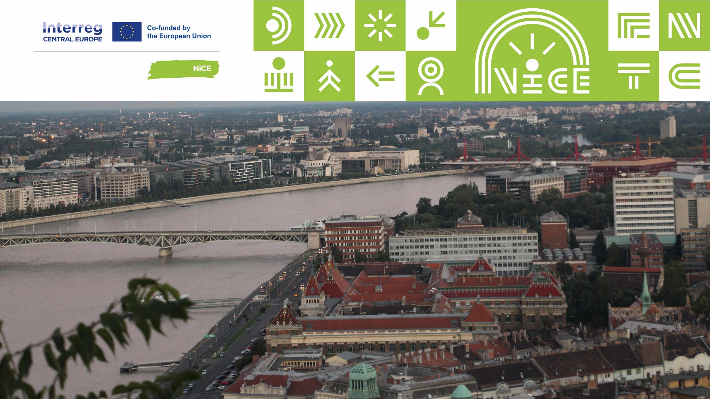

**Dr. Szabó Mariann** közgazdász, kutató, tanszékvezető-helyettes, egyetemi adjunktus a BME Környezetgazdaságtan és Fenntartható Fejlődés Tanszékén. Kutatásai fókuszában a fenntarthatósági kihívásokra adható válaszok és térbeliség összefüggései állnak. 2023 óta számos hazai és nemzetköz kutatási projekt részvevője és vezetője (fenntarthatósági programok és stratégiák, területi együttműködési Interreg projektek, Veszprém-Balaton 2023 Európa Kulturális Fővárosa Program). Jelenleg a Tanszéken 2023 és 2026 között futó, nyolc országot felölelő ‘From Niche to Centre - City Centres as Places of Circular Lifestyles’ Interreg CENTRAL EUROPE project első munkacsomagjának vezetője körforgásos gazdaság területen.

**Bozsoki Fruzsina** alapképzését tekintve környezetmérnök, mestertanulmányait a BME GTK regionális és környezeti gazdaságtan mesterképzésén végezte, jelenleg a Budapesti Műszaki és Gazdaságtudományi Egyetem Környezetgazdaságtan és Fenntartható Fejlődés Tanszékének PhD hallgatója, kutatója. Kutatási témái a városi barnamezős területek revitalizációja és a városi fenntarthatóság. A 2024/2025-ös tanévben Egyetemi Kutatói Ösztöndíj Program ösztöndíjas.

**Vincze Dorottya** alapszakos környezetmérnök hallgató, a 2024/2025-ös tanévben Egyetemi Kutatói Ösztöndíj Program ösztöndíjas, kutatásaiban a csomagolásmentes üzletek hosszútávú működésének vizsgálatát tűzte ki célul a budapesti agglomerációban. Tanulmányai mellett Dorottya aktív civilszervezeti tevékenységet is folytat, többször adott már elő Fenntarthatósági Témahéten, valamint a ZÖLD XVII ’fenntartható fejlődés Budapest XVII. kerületi csoportja’ aktív közreműködője.

**Megannyi területen hozhatunk tudatos fogyasztói döntést. Hogy induljunk el? Mennyiben segítenek bennünket a városok? Energiafelhasználás, közlekedés, élelmiszerfogyasztás, ruházkodás, tartós fogyasztási javak – mire figyeljünk?**

*A program a CE0100312 NiCE Interreg Central Europe projekt támogatásával valósul meg.*

