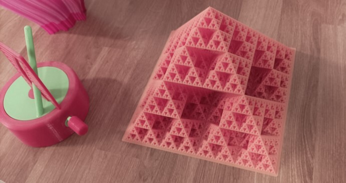

[Eper Miklós](https://math.bme.hu/~eperm/)

*A szereplők a Wigner Jenő szakkollégium tagjai, matematika illetve fizika szakos hallgatók a BME-n.*

A látogatók érdekes feladatokon keresztül próbára tehetik magukat. Új ismereteket szerezhetnek a matematika különböző területeiről a lelkes matematikus hallgatóktól.

