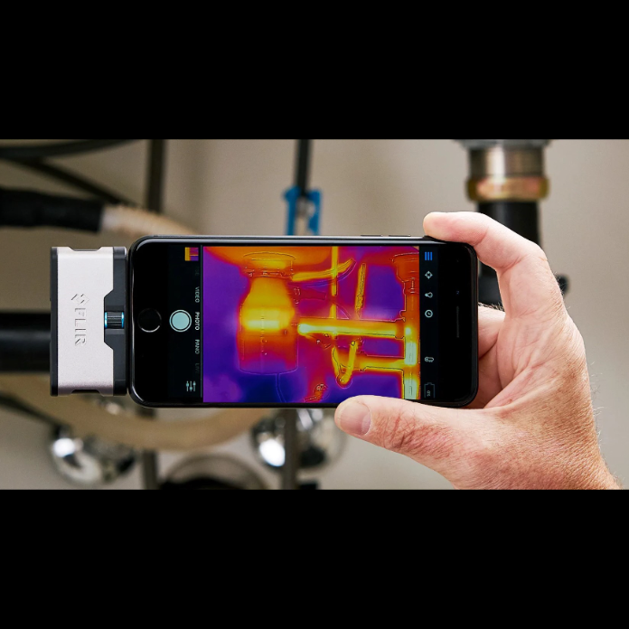

[A BME Energetikai Gépek és Rendszerek Tanszék munkatársai](http://www.energia.bme.hu/munkatarsak/)

A hőenergia egy az univerzumunkat formáló rejtélyes, láthatatlan erő. Mégis hogy érzékelhetjük és hasznosíthatjuk különféle célokra? A programon szakértőktől tudhatod meg hogyan vizsgálják és értékelik a hőtani folyamatokat, akár a Földön, akár az űrben.

