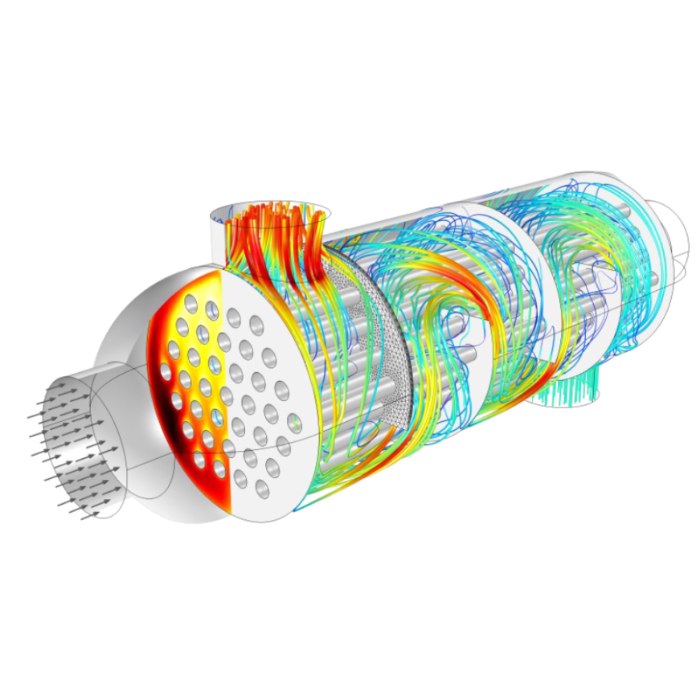

[A BME Energetikai Gépek és Rendszerek Tanszék munkatársai](http://www.energia.bme.hu/munkatarsak/)

Légy részese a szimulációk izgalmas világának! Interaktív programunk során bemutatjuk, miért és hogyan használják a szakemberek a szimulációs technikákat a tervezésben és problémamegoldásban, majd te magad is kipróbálhatod mindezt.

