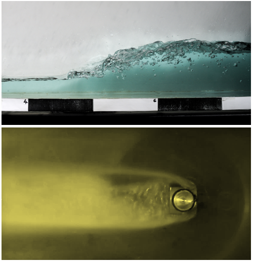

**Gulyás András**: okleveles gépészmérnök (MSc), jelenleg laborvezetőként dolgzik a HDR Tanszéken. Fő szakterülete az áramlástani méréstechnika.

**Dr. Csizmadia Péter** okleveles gépészmérnök, Ph. D., jelenleg a HDR Tanszéken adjunktus pozícióban dolgozik. Fő szakterülete a nemnewtoni folyadékok vizsgálata áramlástechnikai gépek esetében. 

**Sándor Levente Gábor** okleveles gépészmérnök (MSc), jelenleg doktoranduszként dolgozik a HDR Tanszéken. Fő kutatási területét a hemodinamikai kutatások (véráramlás) jelentik.  

Mi a közös egy tönkrement hajócsavar és egy hangos vízforraló között? Hogyan alakul ki egy nyíltfelszínű hullám? Kísérleti berendezéseinken bemutatjuk ezen szép, de olykor pusztító erejű áramlástani jelenségeket. 

