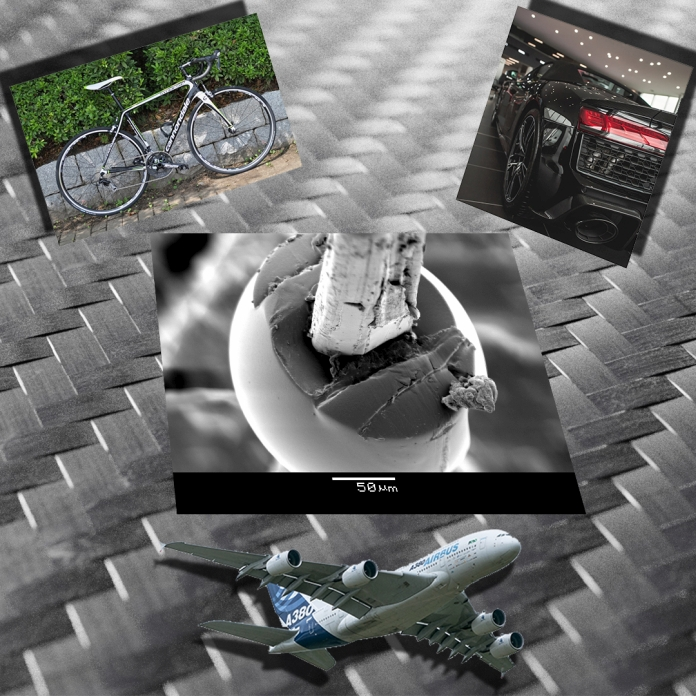

[Dr. Morlin Bálint](http://www.pt.bme.hu/munkatarsadatlap.php?id=62kg49hu387647td29786bpccxc96c35466338Bo&l=m), 
[Pinke Balázs](https://tudprog.bme.hu/kutatok_ejszakaja/profilok/pinke_balazs_gabor)

Miért használnak polimer kompozitokat a repülőgépek, versenyautók, versenybiciklik gyártásánál? Miben tud többet (vagy éppen kevesebbet) a szénszál a fémeknél? Hogyan vizsgálják és mi alapján minősítik ezeket az erősítőanyagokat? Még csak a sorozatokban hallottál elektronmikroszkópról? Itt az idő, hogy ez megváltozzon!

