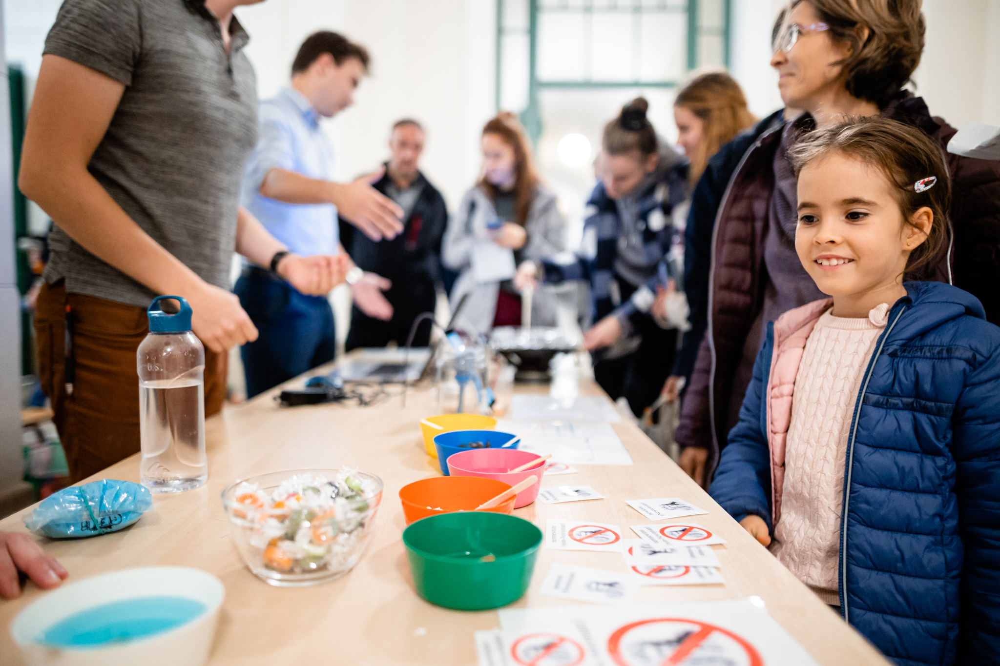

**Gulyás András**: okleveles gépészmérnök (MSc), jelenleg laborvezetőként dolgzik a HDR Tanszéken. Fő szakterülete az áramlástani méréstechnika.

**Gyürki Dániel** okleveles gépészmérnök (MSc), jelenleg tudományos segédmunkatársként dolgozik a HDR Tanszéken. Fő kutatási területét a hemodinamikai kutatások (véráramlás) jelentik.  

**Friedrich Péter** okleveles gépészmérnök (MSc), jelenleg doktoranduszként dolgozik a HDR Tanszéken. Fő kutatási területét a hemodinamikai kutatások (véráramlás) jelentik.  

**Krähling Péter** okleveles gépészmérnök (MSc), jelenleg doktoranduszként dolgozik a HDR Tanszéken. Fő kutatási területét a szonokémiai kutatások (buborék dinamika) jelentik.  

**Kalmár Péter** okleveles gépészmérnök (MSc), jelenleg doktoranduszként dolgozik a HDR Tanszéken. Fő kutatási területét a szonokémiai kutatások (buborék dinamika) jelentik.  

**Az áramlástannal bárhol találkozhatunk legyen az sütikészítés, zenehallgatás, vérnyomásmérés, művészet vagy műszaki alkalmazások. Kísérleteinket játékos formában mutatjuk be a napelemes hajón és akusztikán át, a nemnewtoni folyadékokig.**

