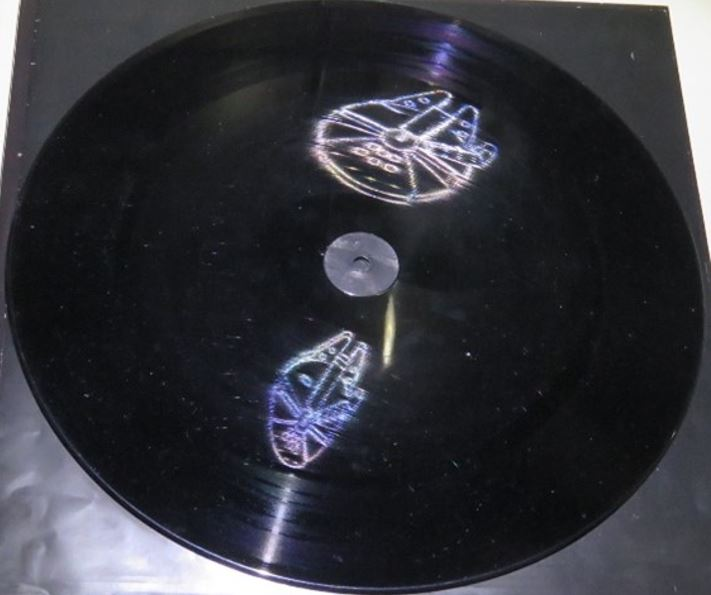

//---
layout: collection_kutej
tud_title:  Kutatók éjszakája 2024
tud_intezmeny: BME TTK
tud_intezmeny_rovid: TTK
tud_latogato: KF
title: Optikai érdekességek
tud_programfelelos: Dr. Bokor Nándor
tud_eloadok: Dr. Bokor Nándor
tud_tipus: Csak személyes jelenléttel látogatható
tud_online: 
tud_helyszin: BME K épület aula
tud_idopont: 2024. szeptember 27. 16:00-18:00
tud_regisztracio: 
tud_url: 
tud_reg: nem, nem
date:  2024-08-27
---

[Dr. Bokor Nándor](https://dept.physics.bme.hu/Bokor_Nandor)

Kicsiket és nagyokat egyaránt szeretettel várunk, hogy megismerkedjenek látványos érdekességekkel az optika világából.
Olyan, a nagyközönség számára talán kevéssé ismert jelenségeket mutatunk be mint a moiré-hatás, karcholográfia, varázstükrök, kausztikus leképezés, integrált fényképezés, optikai aktivitás, száloptikai nagyítás.

