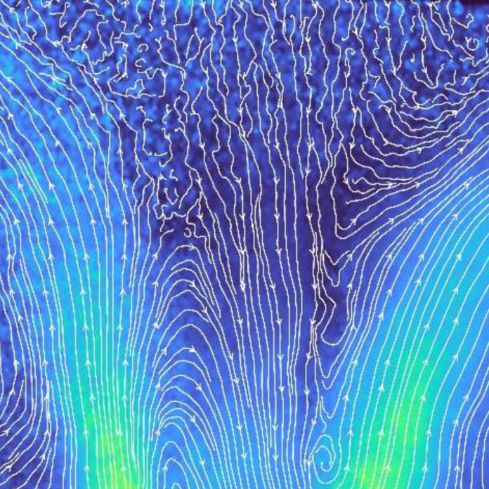

[A BME Energetikai Gépek és Rendszerek Tanszék munkatársai](http://www.energia.bme.hu/munkatarsak/)

Hogyan tehetjük láthatóvá az áramlásokat? Figyeld meg az égőterekben kialakuló sebességeket egy modern méréstechnika, a Particle Image Velocimetry segítségével. A program során megismerheted az eszköz működését és egy valós mérésben is részt vehetsz.

