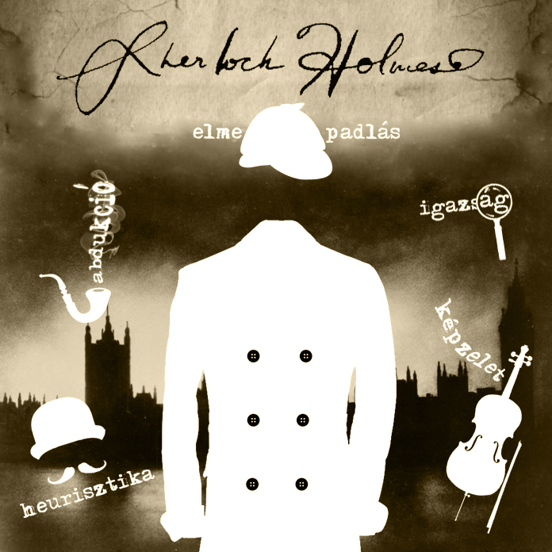

Vajon miért nyűgöznek le minket mind a mai napig Sherlock Holmes történetei? Miben áll elméjének különlegessége? Mi is válhatnánk ilyen nagyszerű következtetőmasinává?
Előadásunkból kiderül, hogy sikeres nyomozásainak egyik titka az elmepadlás technikája és az is, hogy elfogult gondolkodásmódunk és emlékeink miként befolyásolhatják következtetéseinket.
Megtudhatjuk azt is, hogy miért nem dedukció adja az alapját Sherlock Holmes logikájának. Egy képzeletbeli nyomozásra is meginvitáljuk a közönséget, mely során világossá 
válik sherlocki és a watsoni elme közötti eltérés.
Ahogy a zseniális detektív mondaná: „A játszma elkezdődött.”

