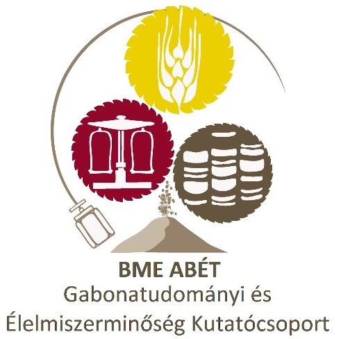

[Dr. Tömösközi Sándor](https://tudprog.bme.hu/kutatok_ejszakaja/profilok/tomoskozi_sandor)

A gabonák, és ezen belül is a búza stratégiai és gazdasági jelentőségű élelmiszer alapanyag, élelmezésünk, történelmünk, kultúránk meghatározó része. Tudunk-e eleget róluk? Hogyan alakult ki a búza- és általában a gabona alapú táplálkozás? Mit „tud” a búza, amire egyetlen más növény szemtermése sem képes? Milyen táplálkozási és technológiai értéket képviselnek az egyes gabonafajok, fajták, újra felfedezett ősi gabonák és az ún. álgabonák (pl. amaránt vagy hajdina) az egészséges táplálkozásban? Mitől függ a gabona-, liszt- és termékminőség? Jelent-e a búza, rozs, árpa és általában a gabonafogyasztás egészségügyi vagy élelmiszerbiztonsági kockázatot? Cöliákia, lisztérzékenység, allergia, gluténmentes táplálkozás: alapvető szükségszerűségből divat?  Milyen fogyasztói igények és fejlődési irányok azonosíthatóak a 21. század gabonaiparában? A feldolgozóipar (sütő- és tésztaipar, cukrászat, gasztronómia) valamint az ember, mint fogyasztó örök dilemmája: a hagyományőrzés és innováció egyensúlya. Ilyen és hasonló témákat járunk körül, illetve ezekre a kérdésekre keresünk válaszokat közösen az előadáson.

Az esemény a BME Alkalmazott Biotechnológia és Élelmiszertudományi Tanszékén megrendezésre kerülő [“Legyél te is biomérnök!”](https://kutatok.org/abettt/2024/09/04/kutatok-ejszakaja-2024-legyel-te-is-biomernok-programsorozat/
) programsorozat része.

