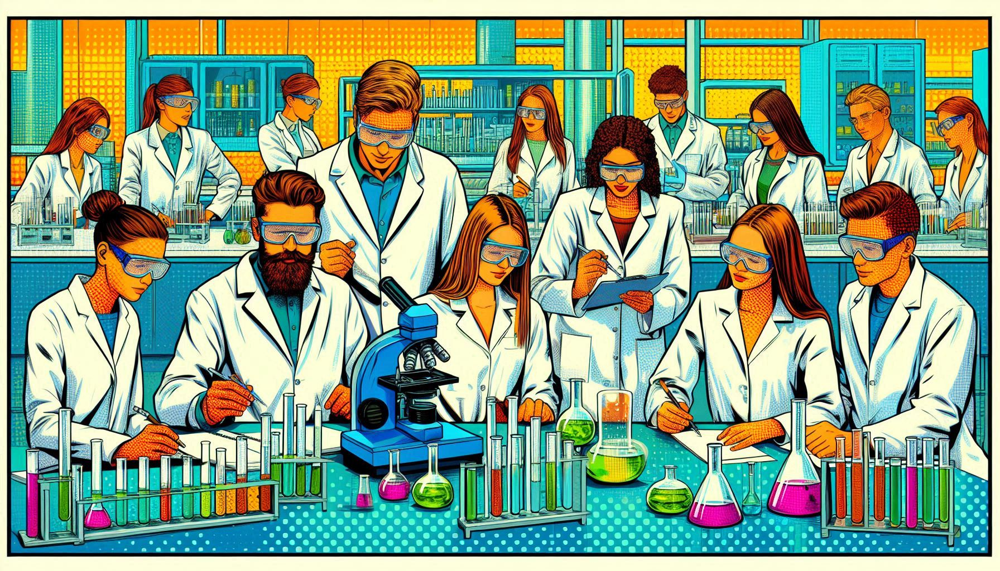

[Murányi Gábor](https://vkkt.bme.hu/muranyi-gabor): Okleveles infrastruktúra-építőmérnök, tudományos segédmunkatárs a Vízi Közmű és Környezetmérnöki tanszéken. Kutatási témája alternatív árvízvédelmi megoldások stratégiai lehetőségeinek tudományos megalapozása.

[A BME VKKT munkatársai](https://epito.bme.hu/vkkt/munkatarsak)

Szabaduló szoba (sőt, labor!) a Műegyetemen! Játékos feladatok megoldása során ismerkedhetsz a vízkémiával, vízanalitikával, vízi közművekkel és a vízhez kapcsolódó környezeti kérdésekkel. Közben betekintést nyerhetsz a tanszékünkön folyó munkákba is. Meg tudjátok oldani a Vízlabor rejtélyét? 

