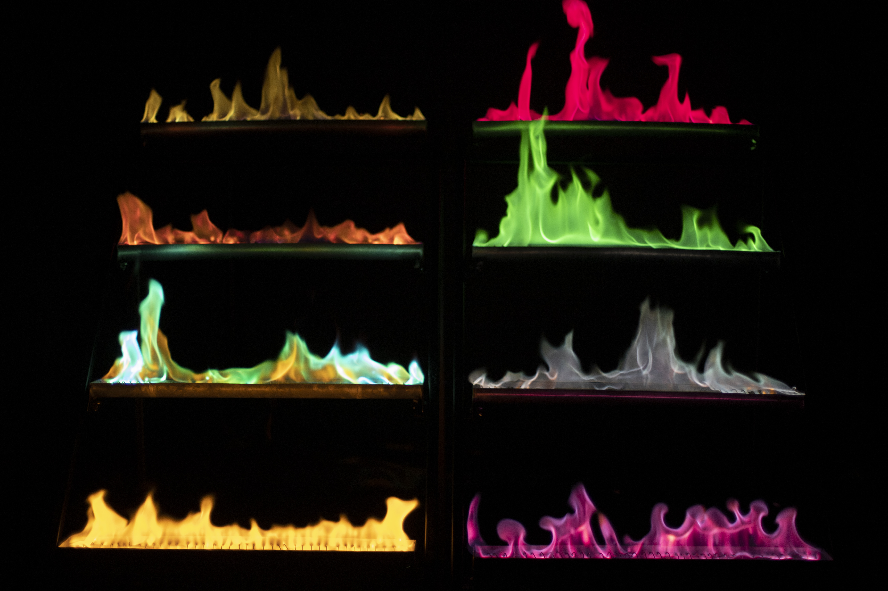

[Härtlein Károly](http://goliat.eik.bme.hu/~hartlein), [Roland Alex](https://alexsysflameshow.com/)

A tűzijátékkal ellentétben csendesek, mégis ugyanolyan káprázatos színkavalkád érhető el és sokkal hosszabb ideig gyönyörködhet a színes lángok látványában, kevesebb füst kibocsátásával.
A klasszikus módon elműködtetett erőteljes hanghatású pirotechnikai termékekkel ellentétben nem hat zavarólag a kutya, illetve más állatok viselkedésére; állatbarát a szolgáltatásunk.

