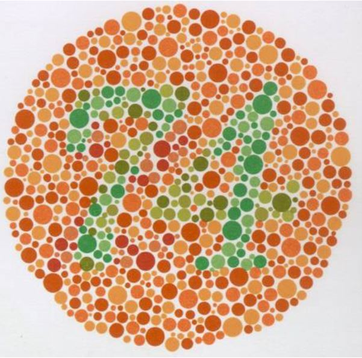

**Dr. habil Ábrahám György professor emeritus:** A műszaki optika professzora, fő kutatási területe az emberi színlátás

**Szabó Máté**: PHD hallgató

Magyar világszabadalom lett a színtévesztés korrigálása színszűrős szemüvegekkel. A program keretében a jelentkező színtévesztők diagnosztizálásra kerülnek, utána pedig kipróbálhatják a színtévesztést korrigáló szemüvegeket. 

**Részletek:**
A vizsgálat + a korrigálás kb. 15 percig tart. Egyszerre 1fő + kísérő vehet részt -érkezési sorrendben, nem kell regisztrálni.

